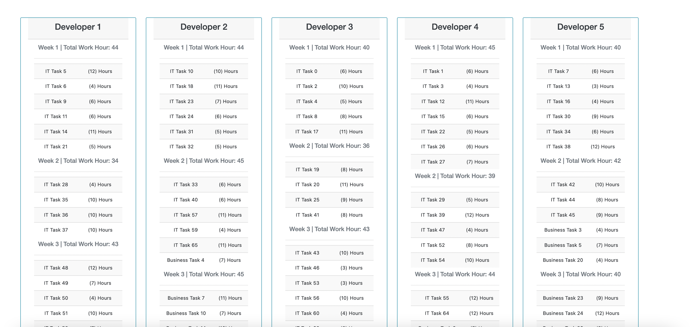

#  Case App

Execute following commands in order to run project
````
composer update
cp .env.example .env
php artisan migrate
php artisan db:seed
php artisan fetch:task
````
And finally run `php artisan serve` command
````
php artisan serve

````
screenshot of the app


